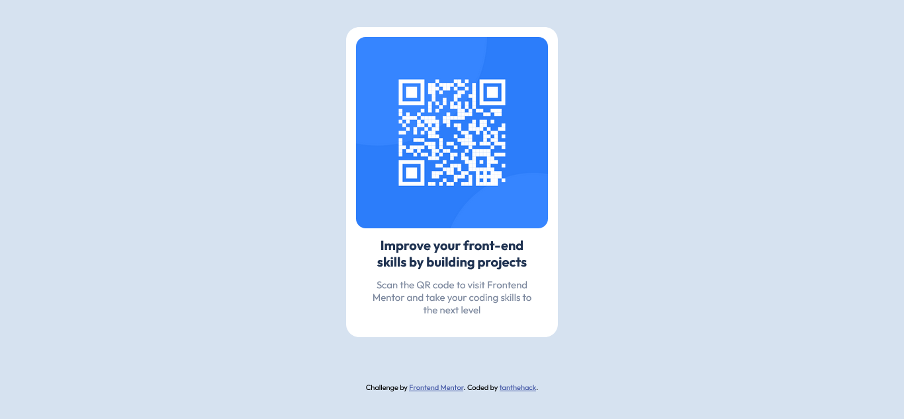

# Frontend Mentor - QR code component solution

This is a solution to the [QR code component challenge on Frontend Mentor](https://www.frontendmentor.io/challenges/qr-code-component-iux_sIO_H). Frontend Mentor challenges help you improve your coding skills by building realistic projects. 

## Table of contents

- [Overview](#overview)
  - [Screenshot](#screenshot)
  - [Links](#links)
- [My process](#my-process)
  - [Built with](#built-with)
  - [Continued development](#continued-development)
  - [Useful resources](#useful-resources)
- [Author](#author)
- [Acknowledgments](#acknowledgments)

## Overview

### Screenshot

### Links
- Live Site URL: [Netlify Site](https://master--symphonious-custard-a152eb.netlify.app/)

## My process

### Built with

- Semantic HTML5
- CSS custom properties
- Flexbox
- Mobile-first workflow

### Useful resources

- [Semantic HTML Cheatsheet](https://www.codecademy.com/learn/learn-html/modules/learn-semantic-html/cheatsheet) - This helped me to set up the HTML semantically. It's a short and easy to understand cheatsheet and really liked this website and will use it going forward.

## Author

- Frontend Mentor - [@tanthehack](https://www.frontendmentor.io/profile/yourusername)
- Twitter - [@tanielouu](https://www.twitter.com/yourusername)
